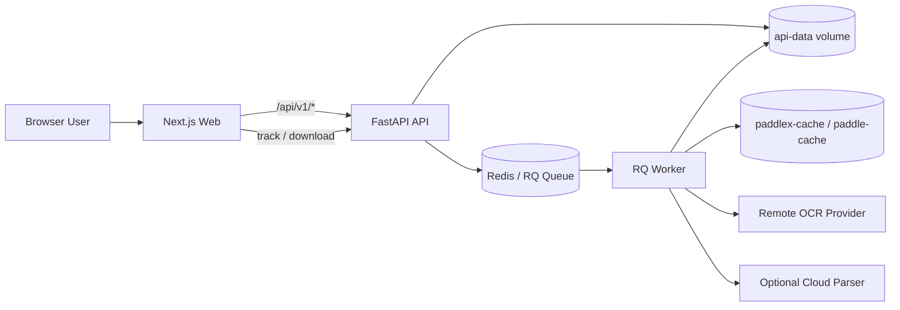
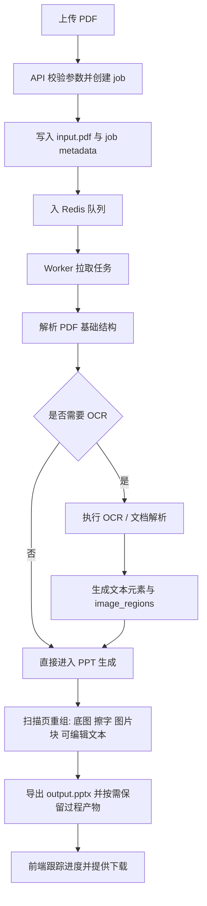
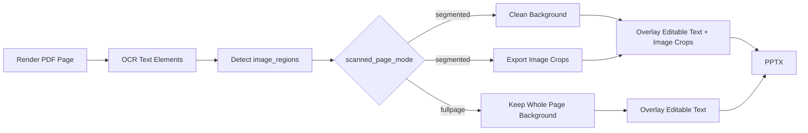

# PDF2PPT

Convert scanned PDFs, slide screenshots, and image-heavy documents into editable PPTX with OCR, layout reconstruction, and Docker deployment.

[](https://render.com/deploy?repo=https://github.com/ZiChuanLan/PDF2PPT-cloud-test)
[](https://zeabur.com/templates/UKLIVV)

云部署相关文件：

- Render Blueprint: [render.yaml](/home/lan/workspace/ppt-cloud-test/render.yaml)
- Zeabur 模板: [zeabur.template.yaml](/home/lan/workspace/ppt-cloud-test/zeabur.template.yaml)
- Zeabur 模板页: <https://zeabur.com/templates/UKLIVV>

`PDF2PPT` 用来把 PDF，尤其是扫描版、图片版、课件截图类文档，转换成尽量高保真、尽量可编辑的 PPTX。

它不是单纯把 PDF 截成一张背景图，而是尽量把页面拆成这些层再重组：

- 可编辑文本
- 独立图片块
- 清理过的页面底图
- 最终 PPTX 导出结果

项目目前重点解决三类问题：

- 扫描页怎么尽量保留原始视觉效果，同时把文字变成可编辑对象
- OCR 怎么在本地引擎、AIOCR、文档解析链路之间切换
- Docker 部署怎么尽量简单，默认直接 `docker compose up -d --build`

## 一图看懂

如果你的 Markdown 查看器支持 Mermaid，下面两张图就是最核心的架构和处理流程。

### 部署架构图



### 转换流程图



## 核心能力

- 统一上传与任务跟踪：前端上传 PDF，后端返回 `job_id`，再通过轮询/SSE 获取阶段进度
- 多种解析链路：本地 OCR、AIOCR、百度文档解析、MinerU 云解析
- 扫描页重组：支持整页背景保留或图片块拆分
- 生产导向保留策略：任务默认保留 24 小时，过程图默认不保留，排障时可按任务临时开启
- Docker 生产部署：默认编排就是部署版，不需要另外维护一套复杂脚本

## 快速启动

### 本地开发

```bash
make dev-local
```

会自动启动：

- API: `http://127.0.0.1:8000`，若占用会自动换 `8001`
- Web: `http://localhost:3000`

也可以直接运行：

```bash
bash scripts/dev/local_dev.sh
```

### 生产部署

默认的 `docker-compose.yml` 就是部署版。

1. 复制环境变量模板

```bash
cp .env.example .env
```


2. 启动

```bash
docker compose up -d --build
```

3. 检查状态

```bash
docker compose ps
docker compose logs -f
curl http://127.0.0.1:8000/health
```

默认生产编排行为：

- `web` 对外暴露 `${WEB_PORT}`，默认 `3000`
- `api` 默认只绑定宿主机 `${API_BIND_HOST:-127.0.0.1}:${API_PORT}`，默认 `127.0.0.1:8000`
- `redis` 不对外暴露
- 任务结果和缓存使用 named volume：`api-data`、`paddlex-cache`、`paddle-cache`
- 浏览器默认只访问 Web，同源 `/api/*` 由 Next 反代到容器内 `api:8000`

如果你有自己的域名反代，通常只需要把外部流量转到 `WEB_PORT`，不需要额外公开 `api`。

如果你要直接远程访问 API，可以额外配置：

- `API_BIND_HOST=0.0.0.0`
- `API_BEARER_TOKEN=你的密码`
- `CORS_ALLOW_ORIGINS=https://你的前端域名`

Web 站点默认也会启用一层访问密码；如果你没单独配置，默认值是：

- `WEB_ACCESS_PASSWORD=123456`

建议上线后立刻改成你自己的强密码。

### 云平台单服务后端

如果你准备把后端先部署到 Render、Zeabur 这类平台测试，不想一开始就拆成 `api + worker + redis` 三个独立服务，可以先用仓库里的单服务模式：

```bash
cp .env.example .env
docker compose -f docker-compose.hosted.yml up -d --build
```

这个模式现在专门给“先跑起来再验证”准备，分两种：

- 最简单：`REDIS_URL=memory://`
  不需要单独 Redis，也不需要独立 worker，job 由 API 进程内联执行
- 稍稳一点：`REDIS_URL=你的托管Redis` 且 `EMBEDDED_WORKER_CONCURRENCY=1`
  仍然只部署一个后端服务，但会在同一个容器里额外拉起 worker 进程

更具体地说：

- `docker-compose.yml`
  仍然是标准的 `api + worker + redis`
- `docker-compose.hosted.yml`
  是给 Render / Zeabur 这类“更偏单服务”的平台准备的后端测试编排

如果你直接在这些平台上部署容器，启动命令可以直接用：

```bash
sh /app/scripts/run_hosted.sh
```

推荐的上线顺序是：

1. 先用 `REDIS_URL=memory://` 跑通健康检查和一份小 PDF
2. 再接入平台托管 Redis，并把 `EMBEDDED_WORKER_CONCURRENCY=1`
3. 确认稳定后，再决定要不要拆回独立 `worker`

这个单服务后端模式的关键点只有两个：

- `REDIS_URL=memory://`
  API 进程自己开线程直接跑任务，最适合最低成本验证
- `REDIS_URL=真实 Redis` 且 `EMBEDDED_WORKER_CONCURRENCY=1`
  API 和 worker 仍然在同一个容器里，但任务改回标准队列流转

### Render 一键部署

仓库根目录现在带了 [render.yaml](/home/lan/workspace/ppt-cloud-test/render.yaml)，上面的 Render 按钮会直接按 Blueprint 创建：

- `pdf2ppt-api`
  Docker 后端，运行 `sh /app/scripts/run_hosted.sh`
- `pdf2ppt-web`
  Next.js 前端
- `pdf2ppt-redis`
  Render Key Value

这个 Blueprint 默认行为是：

- API 走托管 Redis
- `EMBEDDED_WORKER_CONCURRENCY=1`，worker 跟 API 在同一个服务里
- `WEB_ACCESS_PASSWORD` 在 Render 创建时手动填写
- `API_BEARER_TOKEN` 由 Render 自动生成，再透传给前端服务

如果你想先在 Render 上压低复杂度，也可以部署后把 API 的 `REDIS_URL` 改成 `memory://`。

### Zeabur 模板配置

README 顶部的 Zeabur 按钮已经直接指向已发布模板页：<https://zeabur.com/templates/UKLIVV>

仓库根目录现在带了 [zeabur.template.yaml](/home/lan/workspace/ppt-cloud-test/zeabur.template.yaml)，也可以直接用官方 CLI 导入项目：

```bash
npx zeabur@latest template deploy -f zeabur.template.yaml
```

如果你要把它发布到 Zeabur 模板市场，再执行：

```bash
npx zeabur@latest template create -f zeabur.template.yaml
```

Zeabur 官方文档现在明确要求：

- 先创建或发布模板
- 再由模板作者在 Dashboard 里复制官方 Deploy Button

当前已发布的 Zeabur 模板代码是 `UKLIVV`，模板页地址是：

```text
https://zeabur.com/templates/UKLIVV
```

如果你还想把“官方 Deploy Button”图片也贴回 README，下一步去 Zeabur Dashboard 打开这个模板，复制官方按钮 URL 即可。

## 访问控制怎么理解

项目现在默认有两层访问边界，但职责不同：

- `WEB_ACCESS_PASSWORD`
  保护 Web 页面和同源 `/api/*` 入口，浏览器用户先解锁再使用。
- `API_BEARER_TOKEN`
  保护直连 `api` 服务的 `/api/v1/*`，适合 MCP、脚本或其他客户端。

如果你还在用 `ppt-mcp`：

- 最简单可用的方式是让 `ppt-mcp` 直接连 `http://127.0.0.1:8000`
- 如果你开启了 `API_BEARER_TOKEN`，再把同一个值配置到 `ppt-mcp` 的 `PPT_API_BEARER_TOKEN`
- 不建议把 `PPT_API_BASE_URL` 指向 `web:3000` 或外部 Web 域名作为默认方案，因为那条入口天然会受到 Web 密码影响

## 服务说明

| 服务 | 作用 | 关键数据 |
| --- | --- | --- |
| `web` | Next.js 前端，负责上传、设置页、任务跟踪、结果下载 | 前端构建产物 |
| `api` | FastAPI 接口，负责创建 job、参数校验、状态查询、下载产物 | Redis job metadata、`api-data` |
| `worker` | 真正执行 PDF 解析、OCR、PPT 生成 | `input.pdf`、`ir.json`、`output.pptx` |
| `redis` | job metadata、队列状态、取消标记 | `job:*`、RQ queue |

## 实际任务流转

### API 层做什么

- 接收上传文件与表单配置
- 规范化 parse engine / OCR provider / AIOCR chain 参数
- 创建 `job_id`
- 把 `input.pdf` 写入 `JOB_ROOT_DIR/<job_id>/`
- 写入 Redis job metadata
- 把任务入 RQ 队列

### Worker 层做什么

Worker 拿到任务后，会在任务目录中写出这些典型文件：

- `input.pdf`
- `ir.parsed.json`
- `ir.ocr.json`
- `ir.json`
- `output.pptx`
- `artifacts/`

默认目录是：

- `api/data/jobs` 本地开发默认落盘位置
- 容器部署时默认是 `/app/data/jobs`

### 任务目录示意

```text
api/data/jobs/<job_id>/
├── input.pdf
├── ir.parsed.json
├── ir.ocr.json
├── ir.json
├── output.pptx
└── artifacts/
    ├── ocr/
    ├── image_regions/
    ├── page_renders/
    ├── image_crops/
    └── final_preview/
```

## OCR 与解析链路

这个项目现在要先区分两层概念：

- Parse Engine：整份文档主链路怎么跑
- OCR Provider / OCR Chain：识字与页面理解具体走哪条 OCR 路

### Parse Engine 语义

| 前端模式 | 含义 | 适合场景 |
| --- | --- | --- |
| `local_ocr` | 本地解析 PDF，再按需要执行本地或 OCR 链路 | 通用默认模式 |
| `remote_ocr` | 以 AIOCR 为主，适合需要远程视觉模型能力的场景 | OCR 质量优先 |
| `baidu_doc` | 百度文档解析链路 | 需要结构化文档解析时 |
| `mineru_cloud` | MinerU 云解析链路 | 适合表格、公式、结构化内容 |

### AIOCR 三条链路

| Chain Mode | 实际路径 | 特点 | 典型模型 |
| --- | --- | --- | --- |
| `direct` | 整页直接送视觉模型 | 最简单，配置最少 | DeepSeek OCR、通用 VL |
| `layout_block` | 本地版面切块，再逐块送视觉模型识别 | 适合小字密集、图文混排 | Qwen VL、GLM、通用 VL |
| `doc_parser` | 走 PaddleOCR-VL 专用结构化通道 | 结构信息更完整，但链路更专用 | `PaddlePaddle/PaddleOCR-VL-1.5` |

### 常见 OCR Provider

| Provider | 含义 | 备注 |
| --- | --- | --- |
| `aiocr` | 远程 OpenAI-Compatible OCR | 推荐用于高质量 OCR |
| `tesseract` | 本地 Tesseract | 最稳定、本地依赖少 |
| `paddle_local` | 本地 PaddleOCR | 纯本地方案 |
| `baidu` | 百度 OCR | 独立 provider |

### 文档解析与 OCR 的关系

不要把所有链路都理解成“只是在换一个 OCR 模型”。

- `AIOCR direct` 更接近整页视觉识别
- `AIOCR layout_block` 是本地先出 bbox，再把切片发给视觉模型识字
- `PaddleOCR-VL doc_parser` 是专用结构化文档识别通道
- `Baidu Doc` 和 `MinerU` 更接近整份文档解析，而不是单纯 OCR

## 扫描页重组逻辑

扫描页最终导出的 PPT，不只是 OCR 结果，还包含一次页面重组。

### 扫描页输出模式

设置项：`scanned_page_mode`

| 模式 | 含义 | 结果特点 |
| --- | --- | --- |
| `segmented` | 尽量把截图、图表、图标裁成独立图片对象 | 方便在 PPT 里单独编辑图片 |
| `fullpage` | 整页保留为背景图，只把识别出来的文字覆盖为可编辑文本 | 最接近原图，风险更低 |

当前默认值是 `fullpage`。

### 文本擦除模式

设置项：`text_erase_mode`

| 模式 | 含义 |
| --- | --- |
| `fill` | 直接擦除文字区域，速度快，当前默认更稳 |
| `smart` | 更保守的清理策略，适合少数特殊页面 |

### 哪些参数影响 OCR，哪些影响最终合成

这点很容易混淆，尤其在 AIOCR 场景里。

#### 直接影响 OCR 识别请求的参数

- OCR provider
- AIOCR provider / base URL / model
- `ocr_ai_chain_mode`
- `ocr_ai_layout_model`
- AIOCR 并发、RPM、TPM、重试次数
- `OCR_PADDLE_VL_DOCPARSER_MAX_SIDE_PX`

#### 不直接影响 OCR 识字，但会影响最终 PPT 合成结果的参数

- `scanned_page_mode`
- `text_erase_mode`
- `image_bg_clear_expand_min_pt`
- `image_bg_clear_expand_max_pt`
- `image_bg_clear_expand_ratio`
- `scanned_image_region_min_area_ratio`
- `scanned_image_region_max_area_ratio`
- `scanned_image_region_max_aspect_ratio`

可以把它们理解成：

- OCR 参数决定“识别出什么文字、什么 bbox”
- 扫描页重组参数决定“哪些区域留作图片块、底图怎么擦、文字最终怎么叠回 PPT”

### 扫描页合成图



## 推荐配置

### 1. 最省事的线上配置

- Parse Engine: `remote_ocr`
- OCR Provider: `aiocr`
- Model: `PaddlePaddle/PaddleOCR-VL-1.5` 或 `DeepSeek OCR`
- `scanned_page_mode=fullpage`

适合先求稳，再逐步打开更多可编辑能力。

### 2. 想把截图/图表拆成独立图片

- `scanned_page_mode=segmented`
- 保持默认图块阈值
- 如果发现小图标没被拆出来，再微调 `scanned_image_region_*`

### 3. 图文混排很多，小字密

- AIOCR chain 试 `layout_block`
- 视觉模型用更强的通用 VL
- 适度开启 block/page 并发，但先小文档验证

## 环境变量说明

### 真正部署必填

| 变量 | 说明 |
| --- | --- |
| `WEB_PORT` | Web 暴露端口，默认 `3000`，可不改 |
| `API_BIND_HOST` | API 绑定的宿主机地址，默认 `127.0.0.1` |
| `API_PORT` | API 暴露端口，默认 `8000`，可不改 |

严格来说，默认 compose 连这两项都可以不手动填，直接用默认值启动。

### 作为服务端默认 OCR 配置时常用

| 变量 | 说明 |
| --- | --- |
| `SILICONFLOW_API_KEY` | 服务端默认远程 OCR API key |
| `SILICONFLOW_BASE_URL` | 服务端默认 OCR 网关地址 |
| `SILICONFLOW_MODEL` | 服务端默认远程 OCR 模型 |

如果你打算完全在前端设置页里填写 OCR 配置，这三项都不是必填。

### 常用可选

| 变量 | 说明 |
| --- | --- |
| `WEB_PORT` | Web 暴露端口，默认 `3000` |
| `API_BIND_HOST` | API 绑定地址；设为 `0.0.0.0` 表示对外开放 |
| `API_PORT` | API 暴露端口，默认 `8000` |
| `JOB_ROOT_DIR` | job 目录根路径 |
| `WORKER_CONCURRENCY` | worker 进程数 |
| `JOB_TTL_MINUTES` | job 元数据与目录保留时长，默认 `1440` 分钟 |
| `JOB_CLEANUP_INTERVAL_MINUTES` | 过期 job 后台清理间隔，默认 `15` 分钟 |
| `OCR_PADDLE_LAYOUT_PREWARM` | 预热 `PP-DocLayoutV3` |
| `OCR_PADDLE_VL_PREWARM` | 启动时预热 PaddleOCR-VL |
| `OCR_PADDLE_VL_DOCPARSER_MAX_SIDE_PX` | doc_parser 输入长边压缩阈值 |
| `NEXT_PUBLIC_API_URL` | 浏览器直接访问的 API 地址，默认留空走同源 |
| `INTERNAL_API_ORIGIN` | Next 容器内访问 API 的地址 |
| `API_BEARER_TOKEN` | 可选 API Bearer 密码；设置后直接访问 `/api/v1/*` 需要带 `Authorization: Bearer <token>` |
| `WEB_ACCESS_PASSWORD` | Web 站点访问密码；默认值为 `123456`，页面与同源 `/api/*` 都需要先解锁 |

### 前端配置和环境变量的关系

这是当前部署里最容易混淆的一点。

- 前端设置页填写的 OCR 配置，会随每次任务提交到后端，worker 按这次任务的参数执行
- `api/worker` 容器现在通过 `env_file: .env` 读取运行时环境变量，所以根目录 `.env` 会真正进入容器
- `.env` 里的 `SILICONFLOW_*` 主要用于“你前端这次没填”或者“你想给整台服务一个默认 OCR 配置”
- `OCR_PADDLE_LAYOUT_PREWARM` 和 `OCR_PADDLE_VL_PREWARM` 这类启动项只能读环境变量，因为容器启动时还没有用户前端表单

所以如果你是自己部署、自己使用，通常可以这样理解：

- 能不能跑任务：前端填好就行
- 想不想免配置直接可用：再配 `.env`
- 想不想在容器启动时提前预热：必须配 `.env`

### 同源部署建议

默认推荐：

```env
NEXT_PUBLIC_API_URL=
INTERNAL_API_ORIGIN=http://api:8000
```

这样浏览器只访问 Web，最省心，也最不容易遇到跨域问题。

如果你是单机自用，想先保持最简单可用，推荐这样理解：

- `api` 保持默认 `127.0.0.1:8000`，不要对公网开放
- `web` 走站点密码访问
- `ppt-mcp` 直接指向 `http://127.0.0.1:8000`
- 只有当你需要“直连 API 也必须带密码”时，再额外开启 `API_BEARER_TOKEN`

### 远程 API 和前端密码建议

如果你想让 API 也能被外部脚本、MCP 或别的客户端直接调用，推荐最少这样配：

```env
API_BIND_HOST=0.0.0.0
API_BEARER_TOKEN=replace-with-a-strong-secret
CORS_ALLOW_ORIGINS=https://ppt.your-domain.com
```

注意：

- 直接请求 API 的客户端需要带 `Authorization: Bearer <API_BEARER_TOKEN>`
- `ppt-mcp` 这类客户端要把同一个值配置到自己的 `PPT_API_BEARER_TOKEN`
- 同源 Web 页面的 `/api/*` 只有在站点已解锁后才会自动转发这个 token，所以前端不会因为你打开 API 密码而失效
- 显式带了 `Authorization` 的 API 客户端可以继续直接走同一个域名入口，不需要 Web 解锁 cookie

Web 密码默认就是开启的；如果你要改掉默认值，直接设置：

```env
WEB_ACCESS_PASSWORD=replace-with-a-site-password
```

这样访问首页、跟踪页、设置页，以及同源 `/api/*` 前都会先进入站内解锁页。

## 任务保留策略

- job 元数据和目录默认保留 24 小时，之后由 API 后台清理线程自动删除
- 首页提交任务时，`保留过程对比图（调试）` 默认关闭
- 关闭时只保留 `input.pdf`、`output.pptx` 和必要元数据，不保留 `artifacts/` 过程图
- 开启时才会保留逐页渲染图、OCR overlay、最终对比图等过程产物，方便去跟踪页排查

## 排障入口

### 常见问题 1：任务卡在 OCR 阶段

先看这些：

- `docker compose logs -f worker`
- 任务状态页 debug events
- 如果该任务开启了 `保留过程对比图（调试）`，再看 `artifacts/ocr/ocr_debug.json`

如果是 AIOCR：

- 看有没有卡在整页请求
- 看有没有卡在 `layout_block` 的某个 block
- 看是否出现 `Retrying request to /chat/completions`

### 常见问题 2：文字识别没问题，但 PPT 里某块变成图片了

先查：

- 先确认这个任务是否开启了 `保留过程对比图（调试）`
- 若已开启，再查 `artifacts/image_regions/*.regions.json`
- 若已开启，再查 `artifacts/image_regions/*.crops.json`
- 若已开启，再查相关 `artifacts/` 裁图目录

这通常不是 OCR 模型本身问题，而是扫描页图片块识别和后续合成策略的问题。

### 常见问题 3：PaddleOCR-VL 首次很慢

先区分：

- 是不是首次拉 `PP-DocLayoutV3`
- 是不是首次远程 PaddleOCR-VL 冷启动
- 是否启用了 `OCR_PADDLE_VL_PREWARM=1`

### 常见问题 4：前端能开，API 不通

优先检查：

- `docker compose ps`
- Web 容器健康检查
- API 健康检查
- `NEXT_PUBLIC_API_URL`
- `INTERNAL_API_ORIGIN`

## 测试与验证

当前仓库里保留了后端回归测试，主要在 `api/tests/`。

更可靠的跑法是：

```bash
docker compose run --rm --no-deps -v "$PWD/api:/app" api sh -lc \
"python -m pip install --no-cache-dir pytest >/tmp/pytest-install.log && \
 python -m pytest"
```

如果只跑核心 OCR 路由相关测试，可以缩小到具体文件。

## 项目结构

```text
.
├── api/
│   ├── app/                    # FastAPI、worker、OCR、PPT 生成
│   ├── scripts/                # 后端辅助脚本
│   ├── tests/                  # 后端测试
│   └── data/                   # 本地开发时的 job/experiment 产物
├── web/
│   ├── src/app/                # 页面与路由
│   └── src/lib/                # 设置、API、运行配置
├── scripts/
│   ├── dev/                    # 本地开发脚本
│   └── qa/                     # 简单 QA 辅助脚本
├── docker-compose.yml          # 生产部署编排
├── docker-compose.dev.yml      # 开发态编排
└── README.md
```

## License

MIT. See [LICENSE](LICENSE).
